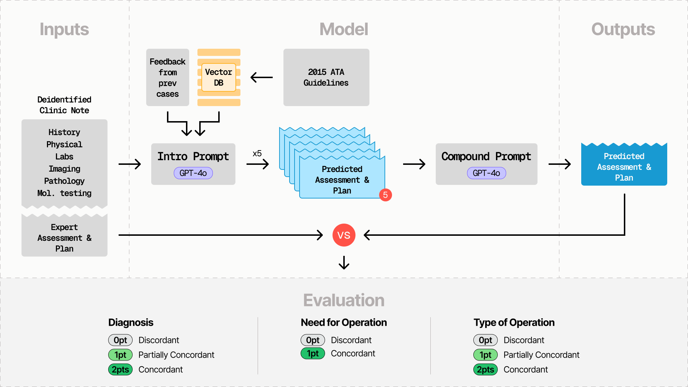

# EndoGPT
Here is the data and code for our LLM-based chatbot for the management of thyroid nodules. 

## Architecture
We utilized the GPT-4o LLM and Pinecone for vector embeddings.
https://chat.openai.com/
http://pinecone.io/

## Guidelines
https://www.ncbi.nlm.nih.gov/pmc/articles/PMC4739132/
We generated a Pinecone vector store from these guidelines to use for Retrieval Augmented Generation (RAG)

## Architecture

